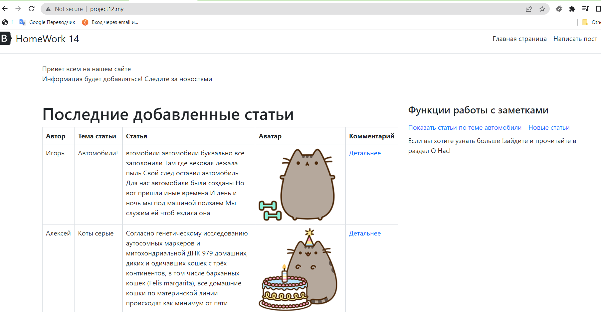
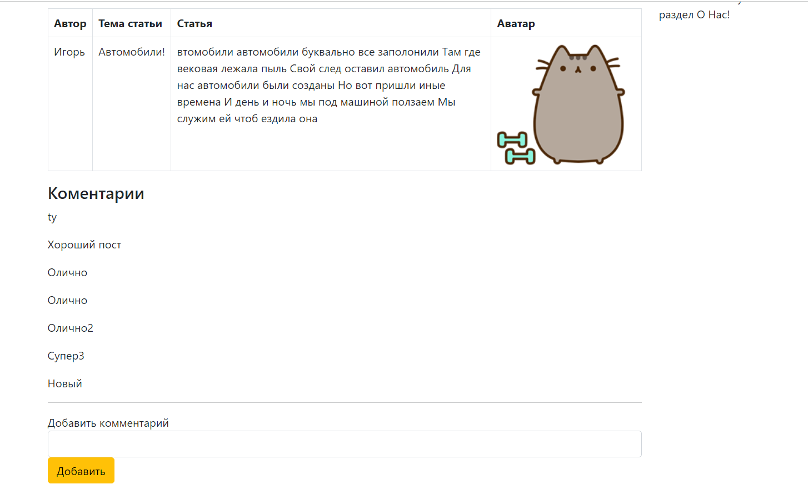
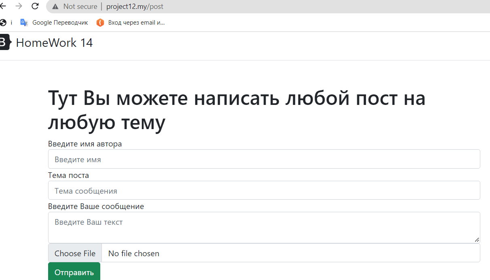

## Домашнее задание № 14.

- Проект является продолжением 13 домашней работы.
- Проект содержит модель post, модель comment, таблицу posts и таблицу comments.
- Связи между таблицами организована по принципу один ко многим, У одного поста может быть много комментариев.
- Главная старица сайта:

- Заходим в пост, тут можно увидеть комментарии к посту, сам пост и можно написать комментарий:

- При добавлении поста можно загрузить картинку:

- Не совсем понял 1 задание про JOIN, пример Join в этом проекте - это связь поста с комментариями!но что мне надо Джоином вывести?у меня выводятся комментарии и посты на страницу.
- 2 задание у меня связаны таблицы один ко многим.
- Понял, что такое жадная загрузка, но как ее реализовать в этом проекте не понял!
- Пример использования трейтов в моем проекте тоже не совсем ясен, я бы использовал тут лучше интерфейсы для методов, так как одинаковых методов у меня нет.
- Ознакомился с полиморфными отношениями и ясно, что мы создаем отдельную таблицу для связи этих сущностей. Но тоже вопрос как мне ее тут применить, ведь мне надо добавить еще одну сущность которую можно комментировать например! 

# Домашнее задание 14.

#### 1. Приведите примеры использования Join в вашем проекте.

#### 2. Свяжите ранее созданные на проекте модели.

#### 3. Для получения связанных записей не забывайте использовать жадную загрузку.

#### 4. Вынесите в трейты методы, которые могут быть использованы не только конкретной моделью в которую они добавлены.

#### 5. Познакомьтесь с полиморфными отношениями и реализуйте их в вашем приложении. Например, если бы у вас была сущность comments, то её можно было бы связать с сущностями: posts, articles, news.

 

 
