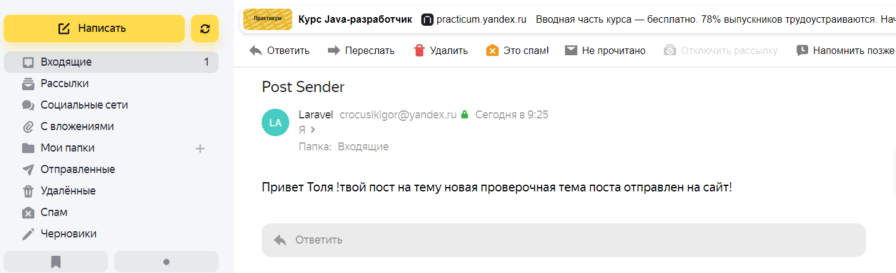

## Домашнее задание № 18.

- Проект является продолжением 14 домашней работы.
- Настроена отправка письма на почтовый мой почтовый ящик yandex.ru при добавлении нового поста:

- отправка организована через драйвер SMTP
- Настроен конфиг в файле .env и mail.php
- С помощью команды php artisan make:mail, был создан класс PostSender наследующийся от класса Mailable, для отправки писем.
- Создано событие
- Создан Слушатель события
- не доделал пока регистрацию события!
- не сделал обработку в блок try catch

# Домашнее задание 18.

#### 1. Настройте отправку email-письма пользователю при каком-либо событии (регистрация, создание новости, оформление подписки на рассылку и т.д.)..

#### 2. Для этого создайте событие и слушателя или подписчика на события и зарегистрируйте их в EventServiceProvider.

#### 3. Создайте шаблон письма и укажите в нем имя пользователя.

#### 4. Оберните блок кода отправки сообщения в конструкцию try-catch, в блоке catch пропишите логирование, используйте заведомо некорректные данные при отправке сообщения для тестирования логирования.

 

 
