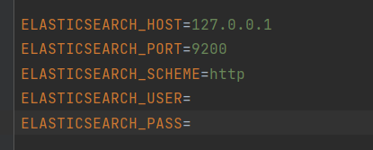

## Домашнее задание № 17.

- Проект является продолжением 14 домашней работы.
- С официального сайта https://www.elastic.co/downloads/elasticsearch, скачал актуальную версию установщика
  
- через cmd был запущен установщик elasticsearch.bat. ТУТ НЕ ПОНЯТНО куда я его установил и установился ли он

- второй вариант запущен снова установщик через командную строку

- Проверил службу Elasticsearch запущена в Windows.

- почему то не работает http://localhost:9200/ не показываются настройки elasticsearch!значит он не установлен?

- Сейчас самая главная проблема я не понимаю, запущен ли у меня elasticsearch или нет
- попробовал подключить elasticsearch к своему проекту
- для этого запустил при помощи команды composer require cviebrock/laravel-elasticsearch
- далее настроил в .env подключение

- хотел, что бы у меня был поиск по статьям
- для индексации данных использовал команду php artisan make:command IndexPosts
- хотел попробовать индексировать данные Post

но не видит PHP elasticsearch
- В связи с этим, У меня следующие вопросы, правильно ли я двигаюсь в установке elasticsearch, какие ошибки я допустил?

# Домашнее задание 17.

#### 1. Скорректируйте реализованную фильтрацию и поиск данных в своем проекте на ElasticSearch. Занесите в ElasticSearch минимум одну сущность проекта..

 

 
